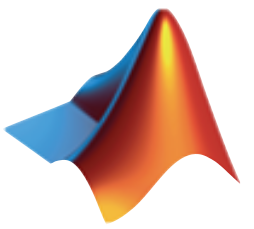
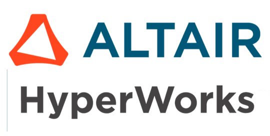

<h3 >Latest Medium Posts</h3>

<!-- BLOG-POST-LIST:START -->
- [用 Python 串接 Slack API，打造遠端電腦使用狀態通知機制](https://wyatthoho.medium.com/%E7%94%A8-python-%E4%B8%B2%E6%8E%A5-slack-api-%E6%89%93%E9%80%A0%E9%81%A0%E7%AB%AF%E9%9B%BB%E8%85%A6%E4%BD%BF%E7%94%A8%E7%8B%80%E6%85%8B%E9%80%9A%E7%9F%A5%E6%A9%9F%E5%88%B6-f5a9b9757a9a?source=rss-1aa7afdfe5e------2)
- [Windows CMD 的環境變數基本操作](https://wyatthoho.medium.com/windows-cmd-%E7%9A%84%E7%92%B0%E5%A2%83%E8%AE%8A%E6%95%B8%E5%9F%BA%E6%9C%AC%E6%93%8D%E4%BD%9C-7b8dcfd76657?source=rss-1aa7afdfe5e------2)
- [常用的 LaTeX 數學式語法](https://wyatthoho.medium.com/%E5%B8%B8%E7%94%A8%E7%9A%84-latex-%E6%95%B8%E5%AD%B8%E5%BC%8F%E8%AA%9E%E6%B3%95-78bfe9d09772?source=rss-1aa7afdfe5e------2)
- [使用 Python 的 logging 模組記錄程式執行過程](https://wyatthoho.medium.com/%E4%BD%BF%E7%94%A8-python-%E7%9A%84-logging-%E6%A8%A1%E7%B5%84%E8%A8%98%E9%8C%84%E7%A8%8B%E5%BC%8F%E5%9F%B7%E8%A1%8C%E9%81%8E%E7%A8%8B-2fd1235060e6?source=rss-1aa7afdfe5e------2)
- [如何連結 MySQL 的 Client 與 Server](https://wyatthoho.medium.com/mysql-%E7%9A%84-client-%E8%88%87-server-%E5%A6%82%E4%BD%95%E9%80%A3%E7%B5%90-d17edd2d7861?source=rss-1aa7afdfe5e------2)
- [執行 Windows CMD 迴圈](https://wyatthoho.medium.com/%E5%9F%B7%E8%A1%8C-windows-cmd-%E8%BF%B4%E5%9C%88-ecd819fbcbef?source=rss-1aa7afdfe5e------2)
<!-- BLOG-POST-LIST:END -->

<h3 >Programming</h3>
  
 
      
      
   
   
  
  
  
  

<h3 >Python Packages</h3>
  
 
      
      
      
      
      
      

<h3 >Typesetting </h3>
  

      
  
      

<h3 >Computer-Aided Engineering</h3>
  

  
  
